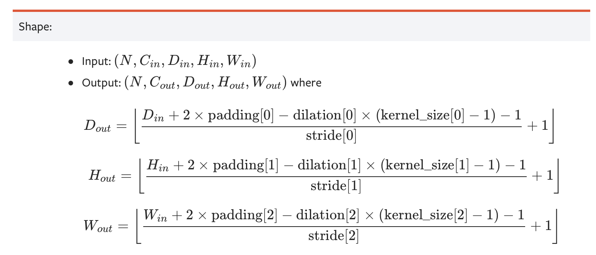

# conv_output_size


## TLDR
A helper function to estimate output size of PyTorch tensor after convolutional layer, according to definitions in [`nn.Conv1d`](https://pytorch.org/docs/stable/generated/torch.nn.Conv1d.html), [`nn.Conv2d`](https://pytorch.org/docs/stable/generated/torch.nn.Conv2d.html) and [`nn.Conv3d`](https://pytorch.org/docs/stable/generated/torch.nn.Conv3d.html)
### Import as follows and define convolutional layer parameters:
```python
import torch
import torch.nn as nn
from conv_output_size import conv1d_output_size, conv2d_output_size, conv3d_output_size

c_i, c_o = 3, 16
k, s, p = 3, 2, 1

print(f"Conv kernel parameters: c_i={c_i}, c_o={c_o}, k={k}, s={s}, p={p}")
```
```bash
>>> Conv kernel parameters: c_i=3, c_o=16, k=3, s=2, p=1
```

### Output size after conv1d:


```python
sample_1d_tensor = torch.ones((c_i, 16))
c1d = nn.Conv1d(in_channels=c_i, out_channels=c_o, kernel_size=k,
                stride=s, padding=p)

output_size = conv1d_output_size(
    sample_1d_tensor.shape, out_channels=c_o, kernel_size=k, stride=s, padding=p)

print("After conv1d")
print("Dummy input size:", sample_1d_tensor.shape)
print("Calculated output size:", output_size)
print("Real output size:", c1d(sample_1d_tensor).detach().numpy().shape")
```
```bash
>>> After conv1d
>>> Dummy input size: torch.Size([3, 16])
>>> Calculated output size: (16, 8)
>>> Real output size: (16, 8)
```

### Output size after conv2d:
```python
sample_2d_tensor = torch.ones((c_i, 64, 64))
c2d = nn.Conv2d(in_channels=c_i, out_channels=c_o, kernel_size=k,
                stride=s, padding=p)

output_size = conv2d_output_size(
    sample_2d_tensor.shape, out_channels=c_o, kernel_size=k, stride=s, padding=p)

print("After conv2d")
print("Dummy input size:", sample_2d_tensor.shape)
print("Calculated output size:", output_size)
print("Real output size:", c2d(sample_2d_tensor).detach().numpy().shape")
```
```bash
>>> After conv2d
>>> Dummy input size: torch.Size([3, 64, 64])
>>> Calculated output size: (16, 32, 32)
>>> Real output size: (16, 32, 32)
```


### Output size after conv3d:
```python
sample_3d_tensor = torch.ones((c_i, 64, 256, 256))
c3d = nn.Conv3d(in_channels=c_i, out_channels=c_o, kernel_size=k,
                stride=s, padding=p)

output_size = conv3d_output_size(
    sample_3d_tensor.shape, out_channels=c_o, kernel_size=k, stride=s, padding=p)

print("After conv3d")
print("Dummy input size:", sample_3d_tensor.shape)
print("Calculated output size:", output_size)
print("Real output size:", c3d(sample_3d_tensor).detach().numpy().shape")
```
```bash
>>> After conv3d
>>> Dummy input size: torch.Size([3, 64, 256, 256])
>>> Calculated output size: (16, 32, 128, 128)
>>> Real output size: (16, 32, 128, 128)
```
